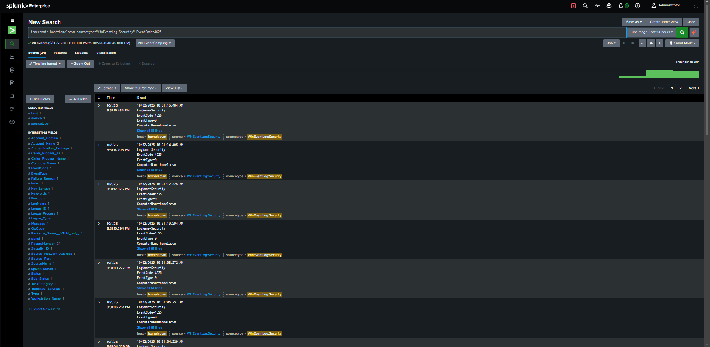
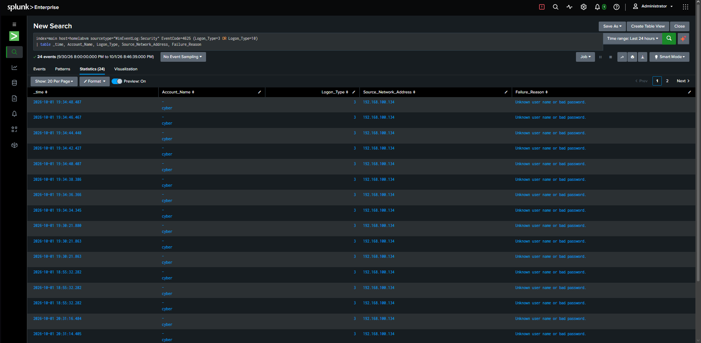
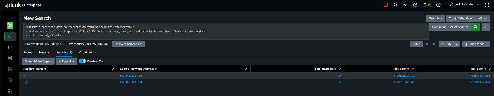
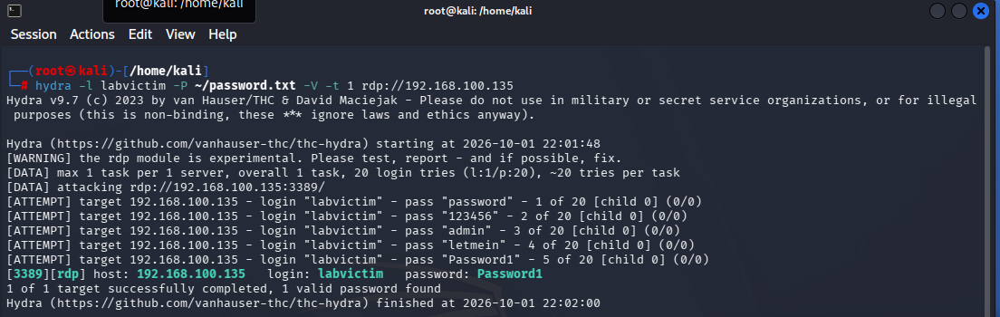
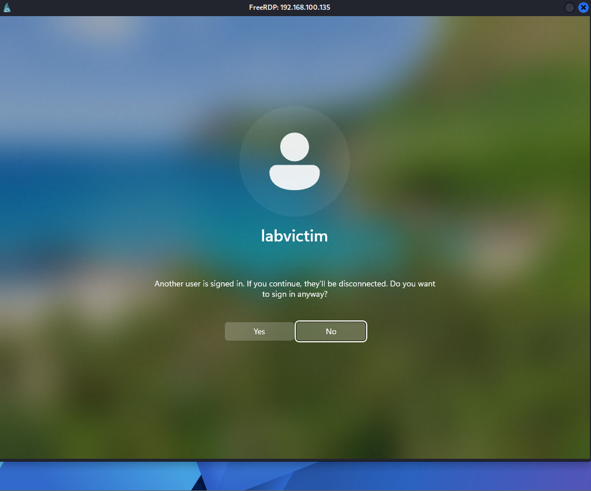
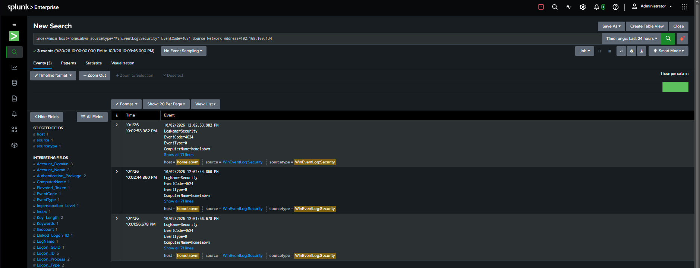

# RDP Brute-Force → Compromise → Splunk Breach Detection

A hands-on **full attack-and-detect kill chain** in a home lab: brute-force RDP with Kali + Hydra, achieve a real account compromise, then detect the whole chain in **Splunk Enterprise** — the failures via Windows **Event ID 4625** and the breach via **Event ID 4624**.

> **Scope & ethics:** All activity was performed on isolated virtual machines I own, on a private lab network. The compromised account (`labvictim`) is a dedicated, disposable local account created solely for this exercise — no real account was targeted. No third-party systems were involved.

---

## TL;DR

| | |
|---|---|
| **Attacker** | Kali Linux — `192.168.100.134` (THC-Hydra, FreeRDP, Nmap) |
| **Target** | Windows `homelabvm` — `192.168.100.135`, RDP 3389 |
| **SIEM** | Splunk Enterprise 10.4.2 (`index=main`, `sourcetype=WinEventLog:Security`) |
| **Technique** | Dictionary brute-force (**T1110.001**) → Valid Accounts (**T1078**) |
| **Target A — `cyber`** | 🛡️ **Resisted** — 0 cracked, 24 failures, account locked out |
| **Target B — `labvictim`** | 💥 **Compromised** — cracked on 5th guess (`Password1`) |
| **Detection** | ✅ 24 × 4625 failures **+** 3 × 4624 breach logons, attacker IP attributed |

**Key takeaway:** the difference between a blocked attack and a breach was **password strength and account lockout** — nothing else. The SIEM's job is to flag the noisy failures and, above all, recognise the quiet success that follows them.

---

## Lab Architecture

```
┌──────────────────────┐        RDP brute-force (3389)      ┌──────────────────────┐
│  Kali Linux           │  ───────────────────────────────▶ │  Windows "homelabvm"  │
│  192.168.100.134      │        Hydra dictionary attack     │  192.168.100.135      │
│  (Attacker + Splunk)  │                                    │  (Target + UF)        │
│                       │ ◀───────────────────────────────  │                       │
│  Splunk :8000 / :9997 │     Event ID 4625 forwarded (9997) │  Universal Forwarder  │
└──────────────────────┘                                     └──────────────────────┘
```

---

## Attack

**Phase 1 — Recon** (confirm RDP is exposed):
```bash
sudo nmap -sV -p 3389 192.168.100.135      # → 3389/tcp open  ms-wbt-server
```

**Phase 2 — Dictionary brute-force:**
```bash
hydra -l cyber -P ~/password.txt -V -t 1 rdp://192.168.100.135
```

Hydra's FreeRDP module is unstable against modern Windows; it required a single thread (`-t 1`) and NLA disabled on the target to reach the logon stage — itself a useful finding (**NLA is an effective pre-auth control**). Full commands in [`attack/attack_commands.sh`](attack/attack_commands.sh).

---

## Detection in Splunk

Four SPL searches take the data from raw events to an alert. Full list: [`detection/splunk_searches.spl`](detection/splunk_searches.spl).

### 1 · Baseline — all failed logons
```spl
index=main host=homelabvm sourcetype="WinEventLog:Security" EventCode=4625
```
24 failed-logon events confirm the pipeline and the attack volume.



### 2 · Isolate the RDP / network brute-force attempts
```spl
index=main host=homelabvm sourcetype="WinEventLog:Security" EventCode=4625 (Logon_Type=3 OR Logon_Type=10)
| table _time, Account_Name, Logon_Type, Source_Network_Address, Failure_Reason
```
Every attempt is **Logon Type 3** from **192.168.100.134** against **`cyber`**, reason *"Unknown user name or bad password"* — with a ~2-second cadence that fingerprints an automated tool.



### 3 · Attacker fingerprint — failures by account + source
```spl
index=main host=homelabvm sourcetype="WinEventLog:Security" EventCode=4625
| stats count AS failed_attempts, min(_time) AS first_seen, max(_time) AS last_seen
        by Account_Name, Source_Network_Address
| sort - failed_attempts
```
One-line verdict: **24 failed attempts against `cyber` from a single source**, bounded by first/last-seen.



### 4 · Burst detection (alert logic)
```spl
index=main host=homelabvm sourcetype="WinEventLog:Security" EventCode=4625
| bucket _time span=1m
| stats count AS attempts_per_min by _time, Source_Network_Address
| where attempts_per_min >= 5
```

---

## The Compromise & Breach Detection

A failed campaign is routine; a **success that follows a burst of failures is an incident.** A dedicated weak account (`labvictim` / `Password1`) was cracked and used to log in over RDP.

**Hydra cracked it on the 5th guess:**



**Interactive RDP session established from the attacker:**



**The breach in Splunk — Event ID 4624 from the attacker IP:**
```spl
index=main host=homelabvm sourcetype="WinEventLog:Security" EventCode=4624 Source_Network_Address=192.168.100.134
```


**Compromise correlation (the highest-value detection)** — a source with many failures *and* a success:
```spl
index=main host=homelabvm sourcetype="WinEventLog:Security" (EventCode=4625 OR EventCode=4624)
| stats count(eval(EventCode=4625)) AS failures, count(eval(EventCode=4624)) AS successes,
        values(Account_Name) AS accounts by Source_Network_Address
| where failures >= 5 AND successes >= 1
```

---

## Detection-as-Code

- **Splunk scheduled alert:** [`detection/savedsearches.conf`](detection/savedsearches.conf) — fires every 5 min on ≥5 failures/min from one source.
- **Portable Sigma rule:** [`detection/rdp_bruteforce_sigma.yml`](detection/rdp_bruteforce_sigma.yml) — vendor-neutral, convertible to other SIEMs.

**Tuning / false positives:** exclude service accounts & known IPs via lookup; baseline normal 4625 volume; restrict to Logon Type 3/10; escalate when a 4625 burst is followed by a 4624 (success) from the same source.

---

## MITRE ATT&CK

| Tactic | Technique | ID |
|---|---|---|
| Reconnaissance | Network Service Discovery | T1046 |
| Credential Access | Brute Force: Password Guessing | T1110.001 |
| Initial Access / Persistence | Valid Accounts | T1078 |
| Lateral Movement | Remote Services: RDP | T1021.001 |

---

## Defensive Recommendations

- Don't expose RDP directly — put it behind a VPN / RD Gateway
- Enforce **NLA**, account lockout, strong passwords + **MFA**
- Deploy the burst-detection alert and restrict inbound 3389 to known IPs

---

## Repo Contents

```
report/        Full written report (PDF + editable Word)
screenshots/   Live Splunk evidence (Event ID 4625)
detection/     SPL searches, savedsearches.conf alert, Sigma rule
attack/        Nmap + Hydra commands, wordlist
```

📄 **Full report:** [`report/RDP_Bruteforce_Splunk_Detection_Report.pdf`](report/RDP_Bruteforce_Splunk_Detection_Report.pdf)

---

*Sagar Bidari — CompTIA Security+ (SY0-701) · SOC Analyst candidate, Melbourne · [bidarisagar.com](https://bidarisagar.com)*
